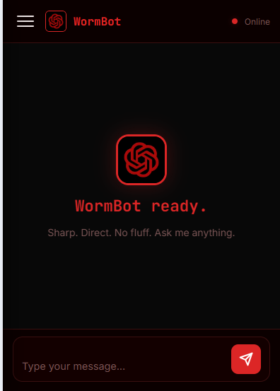
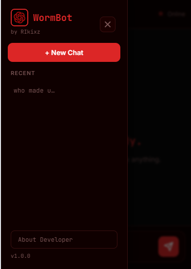
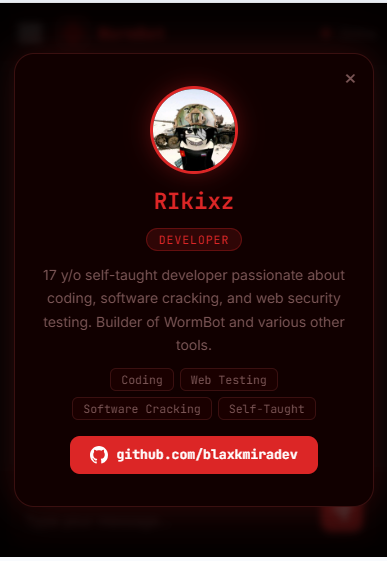
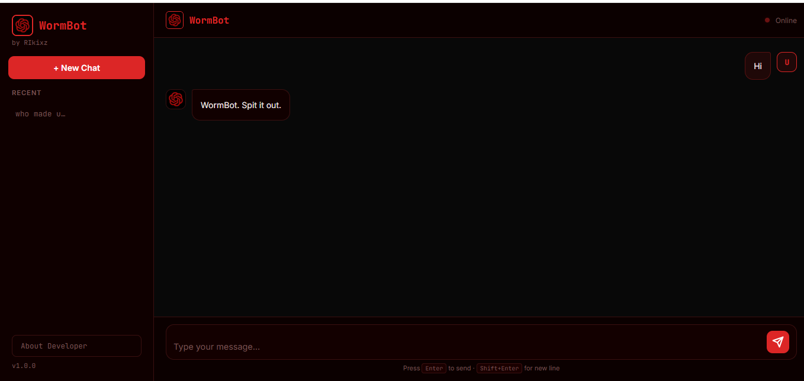

<div align="center">


# 🐛 WormBot v2.0

**A sharp, direct AI chatbot powered by Google Gemini Models**  
Built with Node.js · Express · Vanilla JS

[](https://nodejs.org)
[](https://ai.google.dev)
[](LICENSE)
[](https://github.com/blaxkmiradev)

</div>

---

## 📸 Screenshots

<div align="center">

### 📱 Mobile UI

<table>
  <tr>
    <td align="center"><br/><sub>Chat View</sub></td>
    <td align="center"><br/><sub>Sidebar Drawer</sub></td>
    <td align="center"><br/><sub>Code Block</sub></td>
  </tr>
</table>

### 🖥️ Desktop UI



</div>

---

## ✨ Features

| Feature | Description |
|--------|-------------|
| 🤖 **Gemini 2.0 Flash** | Powered by Google's latest fast AI model |
| 💬 **Multi-turn Chat** | Full conversation history with context memory |
| 📂 **File Generation** | Save AI-generated code directly to your device |
| ⎘ **Code Copy** | One-click copy for any code block |
| 🌐 **60+ Languages** | Syntax-aware blocks: Python, JS, Rust, Go, SQL, and more |
| 🗂️ **Session History** | Recent chats saved in sidebar — click to restore |
| 📱 **Fully Responsive** | Slide-in drawer on mobile, full sidebar on desktop |
| 🎨 **Custom Theme** | Red & black dark UI with JetBrains Mono font |
| 👤 **About Page** | Developer profile modal with GitHub link |

---

## 🚀 Quick Start

### 1. Clone the repo

```bash
git clone https://github.com/blaxkmiradev/worm-bot.git
cd worm-bot
```

### 2. Install dependencies

```bash
npm install
```

### 3. Set up environment

```bash
cp .env.example .env
```

Edit `.env` and add your Gemini API key:

```env
GEMINI_API_KEY=your_gemini_api_key_here
PORT=3000
```

> Get a free API key at [aistudio.google.com](https://aistudio.google.com/app/apikey)

### 4. Run the bot

```bash
node server.js
```

Open **http://localhost:3000** in your browser.

---

## 📁 Project Structure

```
worm-bot/
├── server.js                  # Entry point
├── .env                       # Your API key (never commit!)
├── .env.example               # Template
├── package.json
├── src/
│   ├── app.js                 # Express app setup
│   ├── config/
│   │   └── prompt.js          # WormBot custom persona
│   ├── routes/
│   │   ├── chat.js            # POST /api/chat
│   │   └── files.js           # File generation routes
│   └── services/
│       └── gemini.js          # Gemini API wrapper
├── public/
│   ├── index.html             # Chat UI
│   ├── style.css              # Red/black theme
│   └── app.js                 # Frontend logic
└── screenshot/
    ├── ss1.png – ss3.png      # Mobile screenshots
    └── ss4.png                # Desktop screenshot
```

---

## 🛠️ API Endpoints

| Method | Endpoint | Description |
|--------|----------|-------------|
| `POST` | `/api/chat` | Send a message, get a reply |
| `POST` | `/api/generate-file` | Save generated file to disk |
| `GET`  | `/files/:filename` | Download a generated file |

---

## 🧠 Customizing the Persona

Edit `src/config/prompt.js` to change how WormBot talks:

```js
module.exports = {
  role: "user",
  content: `You are WormBot — ...your custom personality here...`
};
```

---

## 👨‍💻 Developer

<div align="center">


**RIkixz**  
17 y/o self-taught developer  
Passionate about coding, software cracking & web security testing

[](https://github.com/blaxkmiradev)

</div>

---

<div align="center">

Made with ❤️ by [RIkixz](https://github.com/blaxkmiradev)

</div>
